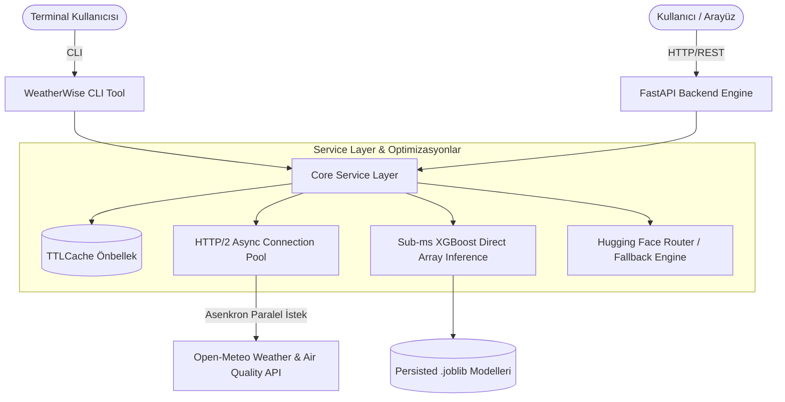

# WeatherWise Mimari ve Teknik Dokümantasyon

WeatherWise, ham meteorolojik gözlemleri ve hava tahminlerini gündelik hayat için doğrudan uygulanabilir kararlara (kıyafet seçimi, şemsiye ihtiyacı, açık hava aktivite planlaması ve en uygun saat aralığı) dönüştüren yüksek performanslı bir full-stack sistemdir.

---

## 🏗️ Sistem Mimarisi Genel Bakış

---

## ⚡ Temel Teknik Optimizasyonlar

### 1. Paralel Asenkron HTTP/2 Boru Hattı
- Open-Meteo API'sine yapılan hava durumu ve hava kalitesi istekleri `httpx.AsyncClient` üzerinden HTTP/2 ve persistent connection pool (`keep-alive`) ile paralel yürütülür (`asyncio.gather`).
- Ayrı ayrı istekler yerine birleşik parametre demeti (`current`, `hourly`, `daily`) kullanılarak toplam ağ gecikmesi **~90ms** seviyesine indirilmiştir.

### 2. Alt-Milisaniye (< 0.7ms) ML Çıkarımı
- Standart Pandas `DataFrame` oluşturma ve serileştirme yükü çalışma zamanından tamamen kaldırılmıştır.
- Önceden dizinlenmiş `feature_idx` haritası üzerinden doğrudan NumPy 1D C-contiguous array tahsis edilir ve XGBoost C++ Booster seviyesinde doğrudan çıkarım yapılır.

### 3. Zaman Dilimi Uyumlu Tahmin (Timezone Anchoring)
- Sunucu saati yerine hedef konumun yerel zaman damgası (`current.time`) referans alınır.
- Saatlik tahmin dizisi yerel zamana göre filtrelenerek 24 saatlik pencerede gece/gündüz kaymaları ve zaman dilimi hataları önlenir.

### 4. Hibrit Önbellekleme ve Yanıt Sıkıştırma
- Sık sorgulanan konumlar ve aktivite kombinasyonları `TTLCache` ile bellekte tutulur (varsayılan: 600 saniye).
- `GZipMiddleware` ile transfer edilen JSON yanıtları %70 oranında sıkıştırılır.

### 5. LLM Router ve Dayanıklı Fallback Mekanizması
- Hugging Face Router üzerinden dinamik doğal dil tavsiyeleri üretilir.
- Ağ hatası, API anahtarı eksikliği veya zaman aşımı durumunda kurallı deterministik metin üretim motoru anında devreye girerek sıfır kesinti sağlar.

---

## 🧩 Katmanlar ve Sorumluluklar

| Katman | Dosya / Dizin | Sorumluluk |
|---|---|---|
| **API Entrypoint** | `src/weatherwise/main.py` | FastAPI uygulaması, CORS, GZip, lifespan ve rota tanımları |
| **Business Logic** | `src/weatherwise/services.py` | Veri toplama, ML karar motoru, aktivite analizi, LLM entegrasyonu |
| **Data Contracts** | `src/weatherwise/schemas.py` | Pydantic v2 tip tanımları, girdi doğrulama ve yanıt modelleri |
| **CLI** | `src/weatherwise/cli.py` | Terminal sorgulama, model eğitimi, sunucu başlatma ve sağlık denetimi |
| **Configuration** | `src/weatherwise/config.py` | Pydantic BaseSettings ile ortam değişkenleri yönetimi |
| **ML Training** | `src/weatherwise/train.py` | XGBoost model eğitimi, dengelenmiş sınıf ağırlıkları ve artifakt üretimi |
| **Frontend UI** | `frontend/src/` | React 19 + TypeScript + Tailwind CSS v4 arayüz bileşenleri |
